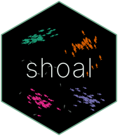

<!-- README.md is generated from README.Rmd. Please edit that file -->

```{r, include = FALSE}
knitr::opts_chunk$set(
  collapse = TRUE,
  comment = "#>",
  fig.path = "man/figures/README-",
  out.width = "100%"
)
```

# shoal <a href="https://belian-earth.github.io/shoal/"></a>

<!-- badges: start -->
[](https://extendr.rs/extendr/extendr_api/)
[](https://github.com/belian-earth/shoal/actions/workflows/R-CMD-check.yaml)
[](https://app.codecov.io/gh/belian-earth/shoal)
[](https://lifecycle.r-lib.org/articles/stages.html#experimental)
<!-- badges: end -->

shoal is a fast, foundational toolkit for clustering in R, with Rust backends
behind one consistent interface. Six clustering algorithms, from k-means to
EVoC, take a numeric matrix or data frame and return one shared result class
that prints and plots the same way, with noise points as `NA`. Alongside them
are the building blocks clustering rests on: pairwise distance matrices and
exact nearest-neighbour search under nine metrics, and the indices for
choosing the number of clusters on evidence. Everything runs multithreaded,
and every function matches or improves on the best R and Python alternatives.

| Function             | Algorithm                  | Backend                                                        | Reach for it when                                                  |
|----------------------|----------------------------|----------------------------------------------------------------|--------------------------------------------------------------------|
| `shoal_kmeans()`     | k-means                    | [linfa](https://github.com/rust-ml/linfa)                      | Clusters are roughly spherical and you know how many to expect.    |
| `shoal_gmm()`        | Gaussian mixture           | linfa                                                          | Clusters are elliptical, or you want soft memberships and `BIC()`. |
| `shoal_dbscan()`     | DBSCAN                     | [petal-clustering](https://github.com/petabi/petal-clustering) | Clusters have arbitrary shape and a common density.                |
| `shoal_hdbscan()`    | HDBSCAN                    | petal-clustering                                               | Clusters have arbitrary shape and varying density.                 |
| `shoal_hclust()`     | Agglomerative hierarchical | [kodama](https://github.com/diffeo/kodama)                     | You want a dendrogram and R's `cutree()` ecosystem.                |
| `shoal_evoc()`       | EVoC                       | In-tree port of [EVoC](https://github.com/TutteInstitute/evoc) | Rows are embedding vectors; you want every granularity at once.    |

| Function                                 | Does                                                                                                                               |
|------------------------------------------|------------------------------------------------------------------------------------------------------------------------------------|
| `shoal_dist()`                           | Pairwise distances under nine metrics, returned as R's own `dist` so `cmdscale()`, `cluster::pam()` and the rest work without glue. |
| `shoal_knn()`                            | Exact k-nearest neighbours by kd-tree or parallel scan, same metrics, with a `plot()` that picks `eps` for DBSCAN.                 |
| `shoal_silhouette()`, `shoal_metrics()`  | Silhouette widths, Calinski-Harabasz and Davies-Bouldin, for choosing the number of clusters.                                       |

## Installation

```r
# install.packages("pak")
pak::pak("belian-earth/shoal")
```

Requires a working [Rust toolchain](https://rustup.rs/) (rustc >= 1.81).

## A first look

The bundled `rings` data is three concentric rings plus scattered noise, the
case that defeats centroid methods. HDBSCAN finds the rings and labels the
noise without being told how many groups to look for.

```{r rings, fig.width=7, fig.height=5, dpi=150}
library(shoal)

fit <- shoal_hdbscan(rings, min_cluster_size = 15L, min_samples = 5L)
fit

plot(fit)
```

Every algorithm returns the same shape of object: `cluster` is the
assignment, `data` the matrix it was fitted to, and `params` records the
call. The same `plot()` and `print()` serve them all, so swapping one
algorithm for another is a one-word change.

The building blocks share the interface. Nearest neighbours of every point,
under any of the metrics `shoal_dist()` offers:

```{r knn}
nn <- shoal_knn(rings, k = 5L, metric = "manhattan")
nn

head(nn$id, 3)
```

## Learn more

- `vignette("shoal")` introduces each algorithm in turn, with a picture of
  what it finds, then the distance and neighbour tools and how to choose the
  number of clusters.
- `vignette("distances")` is about the choices around `shoal_dist()` and
  `shoal_knn()`: which metric, matrix or neighbours, tree or scan, and what
  to build from a neighbour result.
- `vignette("umap")` shows what embedding wide data with UMAP does to each
  algorithm.
- `vignette("evoc")` clusters real sentence embeddings with EVoC and compares
  it with the alternatives.
- The [reference](https://belian-earth.github.io/shoal/reference/) documents
  every function.

## Performance

shoal is built for speed. Every clustering algorithm, the distance matrix
and the nearest-neighbour search are benchmarked against the best R
alternative and, where one exists, the Python one, at matched settings.
Each either matches or improves on them, by margins that grow with the size
and dimension of the data. The results, the scaling figure and the scripts
that produce them are in
[`bench/README.md`](https://github.com/belian-earth/shoal/blob/main/bench/README.md).

The Rust backends run their parallel stages on a thread pool owned by the
package, which by default uses every logical core. `shoal_threads(n)`
resizes it for the session; `options(shoal.threads = n)` or
`RAYON_NUM_THREADS` set the default before the package loads. Results never
depend on the thread count.

## Contributing

Build and workflow notes for working on the package, including the one
about timing, are in
[`DEVELOPMENT.md`](https://github.com/belian-earth/shoal/blob/main/DEVELOPMENT.md).

## Acknowledgements

The algorithms are the work of others. Density-based clustering is bound to
[petal-clustering](https://github.com/petabi/petal-clustering) by
[Petabi](https://github.com/petabi); hierarchical clustering to
[kodama](https://github.com/diffeo/kodama), a Rust port of *fastcluster*;
k-means and Gaussian mixtures to [linfa](https://github.com/rust-ml/linfa);
and EVoC to a Rust port of the
[reference implementation](https://github.com/TutteInstitute/evoc) by Leland
McInnes and the Tutte Institute, validated against fixtures generated from it.
shoal is an R interface to their work.
