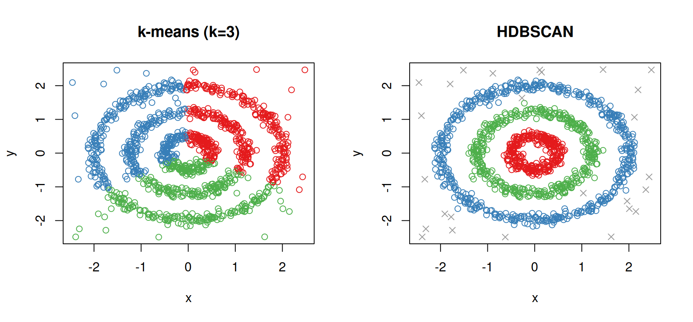
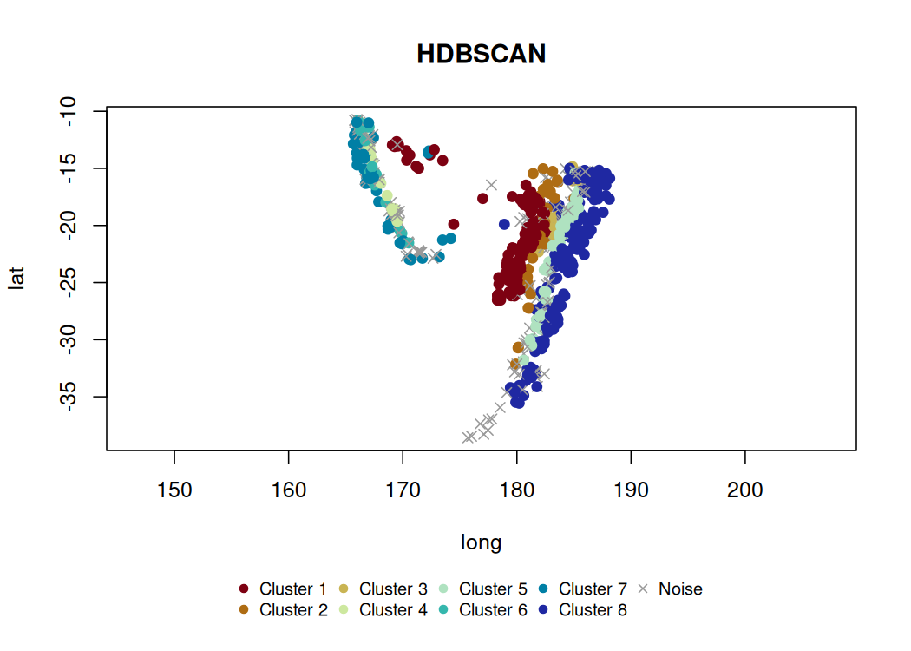
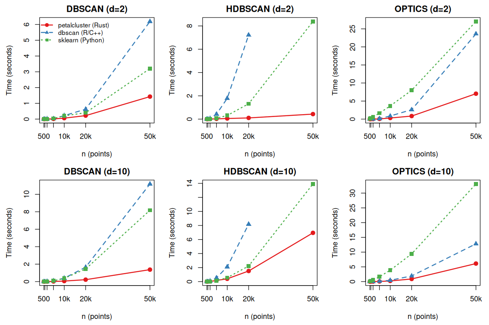

<!-- README.md is generated from README.Rmd. Please edit that file -->

# petalcluster

<!-- badges: start -->

[](https://extendr.github.io/extendr/extendr_api/)
[](https://github.com/belian-earth/petalcluster/actions/workflows/R-CMD-check.yaml)
[](https://app.codecov.io/gh/belian-earth/petalcluster)
[](https://lifecycle.r-lib.org/articles/stages.html#experimental)
<!-- badges: end -->

R bindings to the
[petal-clustering](https://github.com/petabi/petal-clustering) Rust
library, providing fast density-based clustering via **DBSCAN**,
**HDBSCAN**, and **OPTICS**.

## Installation

``` r
# install.packages("pak")
pak::pak("belian-earth/petalcluster")
```

Requires a working [Rust toolchain](https://rustup.rs/) (rustc \>=
1.81).

## Why density-based clustering?

Classical methods like k-means assume convex, evenly-sized clusters.
Real data is rarely that clean. Density-based methods find clusters of
arbitrary shape and naturally separate noise.

``` r
library(petalcluster)

# -- Cluster with both methods --
km  <- kmeans(rings, centers = 3, nstart = 20)
hdb <- petal_hdbscan(rings, min_cluster_size = 15L, min_samples = 5L)

# -- Side-by-side comparison --
cluster_col <- function(labels) {
  pal <- c("#E41A1C", "#377EB8", "#4DAF4A", "#984EA3")
  cols <- rep("grey60", length(labels))
  valid <- !is.na(labels) & labels > 0
  cols[valid] <- pal[((labels[valid] - 1L) %% length(pal)) + 1L]
  cols
}

cluster_pch <- function(labels) ifelse(is.na(labels), 4L, 1L)

par(mfrow = c(1, 2))
plot(rings, col = cluster_col(km$cluster), main =  "k-means (k=3)")
plot(rings, col = cluster_col(hdb$cluster), pch = cluster_pch(hdb$cluster), main ="HDBSCAN")
```



## Example

R’s built-in `quakes` dataset contains 1,000 seismic events near Fiji.
HDBSCAN finds spatial clusters of earthquake activity without needing to
specify the number of groups upfront.

``` r
quakes_hdbscan <- petal_hdbscan(
  quakes[, c("lat", "long", "depth", "mag")]
)
quakes_hdbscan
#> 
#> ── HDBSCAN Clustering
#> Metric: "euclidean"
#> Parameters: alpha = 1, min_samples = 15, min_cluster_size = 15
#> Clusters: 8, Noise points: 199
```

Use `xcol` and `ycol` to plot a single pair of variables — here
longitude vs latitude reveals the geographic structure of the clusters:

``` r
plot(quakes_hdbscan, xcol = "long", ycol = "lat", asp=1)
```



The default plot produces a scatter plot matrix of all variables:

``` r
plot(quakes_hdbscan)
```


## Performance

petalcluster offers a performant alternative for density-based
clustering in R, particularly at scale. The plot below compares
wall-clock time against the
[dbscan](https://cran.r-project.org/package=dbscan) R package and
Python’s [scikit-learn](https://scikit-learn.org/), across dataset sizes
from 500 to 50,000 points.

<figure>

<figcaption aria-hidden="true">Scaling benchmark</figcaption>
</figure>

## Acknowledgements

The heavy lifting is done by the
[petal-clustering](https://github.com/petabi/petal-clustering) crate,
developed and maintained by [Petabi](https://github.com/petabi)
petalcluster is simply an R interface to their work.
