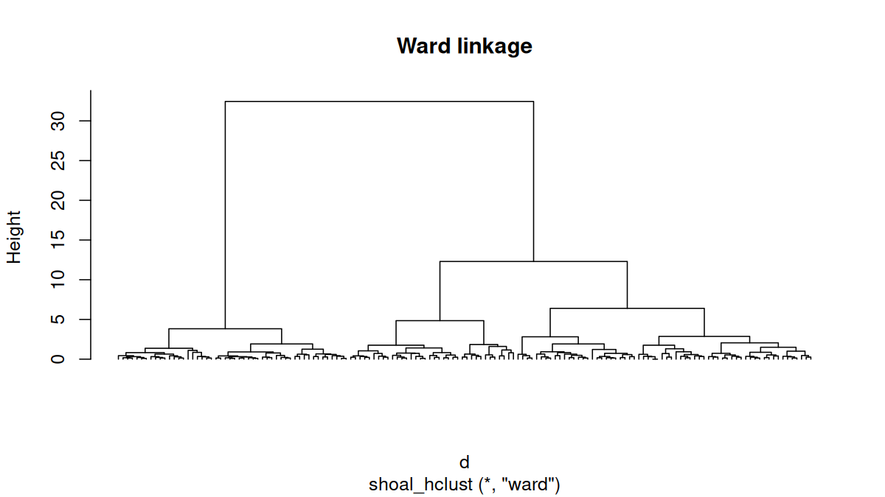
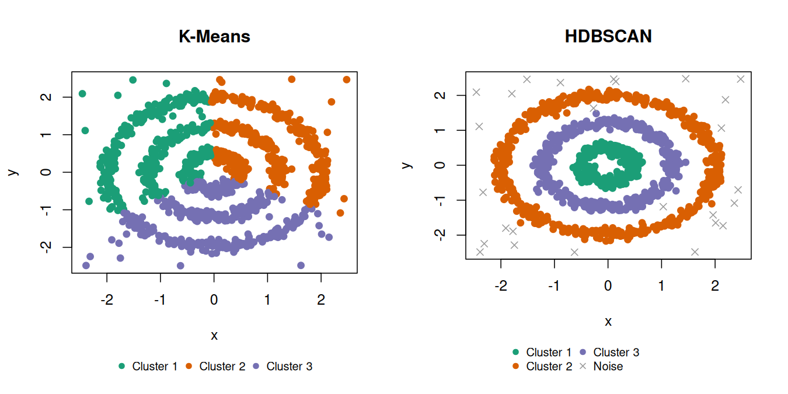
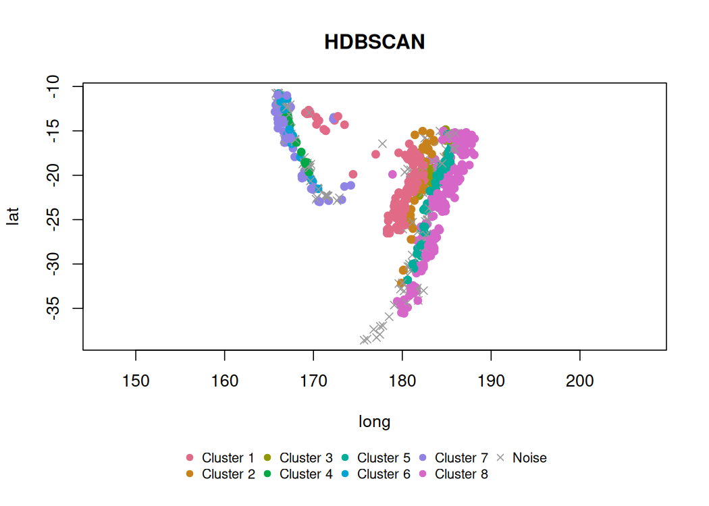

<!-- README.md is generated from README.Rmd. Please edit that file -->

# shoal

<!-- badges: start -->

[](https://extendr.rs/extendr/extendr_api/)
[](https://github.com/belian-earth/petalcluster/actions/workflows/R-CMD-check.yaml)
[](https://app.codecov.io/gh/belian-earth/petalcluster)
[](https://lifecycle.r-lib.org/articles/stages.html#experimental)
<!-- badges: end -->

shoal is a small, foundational set of clustering algorithms with Rust
backends, presented behind one consistent interface. Every algorithm
takes a numeric matrix or data frame, returns an object of the shared
`shoal_clustering` class, and prints and plots the same way. Noise
points are `NA` in the cluster vector, so downstream code never has to
know which algorithm produced a result.

| Function | Algorithm | Backend | Reach for it when |
|----|----|----|----|
| `shoal_kmeans()` | k-means | [linfa](https://github.com/rust-ml/linfa) | Clusters are roughly spherical and you know how many to expect. |
| `shoal_gmm()` | Gaussian mixture | linfa | Clusters are elliptical, or you want soft memberships and `BIC()`. |
| `shoal_dbscan()` | DBSCAN | [petal-clustering](https://github.com/petabi/petal-clustering) | Clusters have arbitrary shape and a common density. |
| `shoal_hdbscan()` | HDBSCAN | petal-clustering | Clusters have arbitrary shape and varying density. |
| `shoal_hclust()` | Agglomerative hierarchical | [kodama](https://github.com/diffeo/kodama) | You want a dendrogram and R’s `cutree()` ecosystem. |
| `shoal_evoc()` | EVoC | In-tree port of [EVoC](https://github.com/TutteInstitute/evoc) | Rows are embedding vectors; you want every granularity at once. |

`shoal_dist()` builds distance matrices, and `shoal_silhouette()` and
`shoal_metrics()` score a clustering so the number of clusters can be
chosen on evidence. Distance matrices and dendrograms are returned as
R’s own `dist` and `hclust` classes, so `cutree()`, `as.dendrogram()`
and `cmdscale()` work without glue.

## Installation

``` r
# install.packages("pak")
pak::pak("belian-earth/petalcluster")
```

Requires a working [Rust toolchain](https://rustup.rs/) (rustc \>=
1.81).

Two vignettes go further than this page: `vignette("shoal")` introduces
each algorithm in turn, and `vignette("umap")` shows what embedding wide
data with UMAP does to each of them.

## A worked example

Every algorithm shares the same shape of call and result. Take the four
measurements in `iris` as a matrix, and ask k-means for three clusters.

``` r
library(shoal)

x <- as.matrix(iris[, 1:4])

km <- shoal_kmeans(x, k = 3L)
km
#> 
#> ── K-Means Clustering
#> Parameters: k = 3, init = kmeans++, n_runs = 10, seed = 1
#> Clusters: 3, Noise points: 0
#> Within-cluster sum of squares: 78.851
#> Cluster sizes: 50, 38, 62
```

The result is a list. `cluster` is the assignment, `data` is the matrix
the model was fitted to, and `params` records the call, so a result can
be inspected long after the code that produced it has scrolled away.

``` r
str(km$cluster)
#>  int [1:150] 1 1 1 1 1 1 1 1 1 1 ...
km$centroids
#>      Sepal.Length Sepal.Width Petal.Length Petal.Width
#> [1,]     5.006000    3.428000     1.462000    0.246000
#> [2,]     6.850000    3.073684     5.742105    2.071053
#> [3,]     5.901613    2.748387     4.393548    1.433871
```

### Choosing the number of clusters

`k` is the central modelling decision, so shoal does not guess it. Fit
across a range and compare. `shoal_metrics()` reports the
Calinski-Harabasz index (higher is better) and the Davies-Bouldin index
(lower is better) for any partition; `shoal_gmm()` results have a
`logLik()` method, so `BIC()` works on them directly.

``` r
ks <- 2:6

indices <- do.call(rbind, lapply(ks, function(k) {
  shoal_metrics(shoal_kmeans(x, k = k))
}))
indices$bic <- vapply(ks, function(k) BIC(shoal_gmm(x, k = k)), numeric(1))

indices
#>     n k calinski_harabasz davies_bouldin      bic
#> 1 150 2          513.9245      0.4042928 574.0178
#> 2 150 3          561.6278      0.6619715 580.8594
#> 3 150 4          530.4871      0.7757009 629.7790
#> 4 150 5          495.5415      0.8059652 670.0892
#> 5 150 6          473.8506      0.9141580 714.9977
```

The indices disagree, which is the honest answer for this data.
Davies-Bouldin and BIC favour two clusters, because setosa is clearly
separated while versicolor and virginica overlap; Calinski-Harabasz
peaks at the three species. Choosing between those readings is a
modelling decision, which is why shoal leaves it to you.

Silhouette widths give the same verdict per observation. They need a
distance matrix, which `shoal_dist()` computes in Rust.

``` r
d <- shoal_dist(x)

sil <- shoal_silhouette(d, km)
head(sil)
#>   cluster neighbour     width
#> 1       1         3 0.8529551
#> 2       1         3 0.8154948
#> 3       1         3 0.8293151
#> 4       1         3 0.8050139
#> 5       1         3 0.8493016
#> 6       1         3 0.7482804
attr(sil, "avg_width")
#> [1] 0.552819
```

### Soft memberships

A Gaussian mixture gives every observation a probability of belonging to
each component rather than a single label. `cluster` is the row-wise
maximum, for consistency with the other algorithms, and `posterior`
holds the full matrix.

``` r
gm <- shoal_gmm(x, k = 3L)
gm
#> 
#> ── Gaussian Mixture Clustering
#> Parameters: k = 3, init = kmeans, n_runs = 1, seed = 1
#> Clusters: 3, Noise points: 0
#> Log-likelihood: -180.196, BIC: 580.859
#> Mixing proportions: 0.333, 0.365, 0.301

round(head(gm$posterior), 3)
#>      [,1] [,2] [,3]
#> [1,]    1    0    0
#> [2,]    1    0    0
#> [3,]    1    0    0
#> [4,]    1    0    0
#> [5,]    1    0    0
#> [6,]    1    0    0
```

### Hierarchical clustering

`shoal_hclust()` accepts the distance matrix from `shoal_dist()`, or raw
data, and returns a standard `hclust` object.

``` r
hc <- shoal_hclust(d, method = "ward")
hc
#> 
#> Call:
#> shoal_hclust(d = d, method = "ward")
#> 
#> Cluster method   : ward 
#> Distance         : euclidean 
#> Number of objects: 150

table(cutree(hc, k = 3), iris$Species)
#>    
#>     setosa versicolor virginica
#>   1     50          0         0
#>   2      0         49        15
#>   3      0          1        35

plot(hc, labels = FALSE, hang = -1, main = "Ward linkage")
```



The `"ward"` method here is R’s `"ward.D2"`; see `?shoal_hclust` for how
each linkage maps onto `stats::hclust()`.

### Predicting new observations

Algorithms with a notion of a cluster centre can assign new rows. Fit on
half of the data and predict the rest.

``` r
train <- x[seq(1, nrow(x), by = 2), ]
test <- x[seq(2, nrow(x), by = 2), ]

fit <- shoal_kmeans(train, k = 3L)
table(predicted = predict(fit, test), species = iris$Species[seq(2, nrow(x), by = 2)])
#>          species
#> predicted setosa versicolor virginica
#>         1      0         24         7
#>         2      0          1        18
#>         3     25          0         0
```

The density-based algorithms have no `predict()` method, because the
capability genuinely does not exist for them.

### Clusters of arbitrary shape

Classical methods assume convex, evenly sized clusters. The bundled
`rings` data breaks that assumption: three concentric rings plus uniform
noise. Density-based methods find the rings and label the noise, without
being told how many groups to look for.

``` r
par(mfrow = c(1, 2))
plot(shoal_kmeans(rings, k = 3L))
plot(shoal_hdbscan(rings, min_cluster_size = 15L, min_samples = 5L))
```



Both plots come from the same `plot()` method: the shared class is what
makes the comparison a one-liner. Noise points are drawn as grey
crosses.

HDBSCAN also returns GLOSH outlier scores, one per observation, and
accepts `metric = "cosine"` for directional data.

``` r
hdb <- shoal_hdbscan(rings, min_cluster_size = 15L, min_samples = 5L)
hdb
#> 
#> ── HDBSCAN Clustering
#> Metric: "euclidean"
#> Parameters: alpha = 1, min_samples = 5, min_cluster_size = 15, boruvka = TRUE
#> Clusters: 3, Noise points: 26
#> GLOSH outlier scores: median 0.079, max 0.965

summary(hdb$outlier_scores)
#>    Min. 1st Qu.  Median    Mean 3rd Qu.    Max. 
#>  0.0000  0.0000  0.0791  0.1783  0.3176  0.9654
```

### Plotting more than two dimensions

With more than two columns, `plot()` draws a scatter plot matrix. Pass
`xcol` and `ycol` to pick a single pair instead. Here R’s `quakes` data,
1,000 seismic events near Fiji, clustered on location, depth and
magnitude, is plotted by longitude and latitude.

``` r
quakes_hdbscan <- shoal_hdbscan(quakes[, c("lat", "long", "depth", "mag")])
quakes_hdbscan
#> 
#> ── HDBSCAN Clustering
#> Metric: "euclidean"
#> Parameters: alpha = 1, min_samples = 15, min_cluster_size = 15, boruvka = TRUE
#> Clusters: 8, Noise points: 199
#> GLOSH outlier scores: median 0.238, max 0.906

plot(quakes_hdbscan, xcol = "long", ycol = "lat", asp = 1)
```



### Embedding vectors

`shoal_evoc()` is for a different kind of input: rows that are embedding
vectors, such as the output of a text or image model, where cosine
geometry is the right model and the number of rows runs to thousands or
millions. EVoC builds a nearest-neighbour graph, learns a compact node
embedding from it and clusters that at several granularities at once.
Every layer is returned, with a persistence score, and `layer` chooses
which one populates `cluster`.

``` r
# Synthetic embeddings: eight topics of unequal size as directions in 48
# dimensions, plus 100 scattered points that belong to none of them.
set.seed(1)
sizes <- c(400, 300, 250, 200, 150, 100, 60, 40)
centres <- matrix(runif(length(sizes) * 48, -1, 1) * 0.6, nrow = length(sizes))
emb <- rbind(
  centres[rep(seq_along(sizes), times = sizes), ] +
    matrix(rnorm(sum(sizes) * 48, sd = 0.1), ncol = 48),
  matrix(runif(100 * 48, -1, 1) * 0.6, ncol = 48)
)
truth <- c(rep(seq_along(sizes), times = sizes), rep(NA, 100))

ev <- shoal_evoc(emb, min_cluster_size = 15L)
ev
#> 
#> ── EVoC Clustering
#> Metric: "cosine"
#> Parameters: n_neighbors = 15, noise_level = 0.5, min_cluster_size = 15,
#> min_samples = 5, n_epochs = 50, seed = 1
#> Clusters: 8, Noise points: 7
#> Layers (finest first, ✔ = selected):
#>   1: 10 clusters, 371 noise, persistence 0
#> ✔ 2: 8 clusters, 7 noise, persistence 346.8
```

The finest layer over-fragments and marks hundreds of points as noise;
the most persistent layer, selected by default, is the useful one.
Comparing it with the truth shows every topic recovered exactly, down to
the one with 40 members. The scattered points are the weak spot: most
are absorbed into the nearest topic rather than flagged, since at this
size a handful of stray directions rarely forms a density gap of its
own.

``` r
table(cluster = ev$cluster, truth, useNA = "ifany")
#>        truth
#> cluster   1   2   3   4   5   6   7   8 <NA>
#>    1      0   0   0 200   0   0   0   0    9
#>    2      0 300   0   0   0   0   0   0    9
#>    3      0   0   0   0   0   0  60   0    4
#>    4      0   0   0   0   0   0   0  40    3
#>    5    400   0   0   0   0   0   0   0    7
#>    6      0   0   0   0 150   0   0   0   18
#>    7      0   0   0   0   0 100   0   0    7
#>    8      0   0 250   0   0   0   0   0   36
#>    <NA>   0   0   0   0   0   0   0   0    7
```

Every layer stays available on the result, so a different granularity is
an index away rather than a refit.

``` r
vapply(ev$layers, function(l) length(unique(l[!is.na(l)])), integer(1))
#> [1] 10  8
ev$persistence
#> [1]   0.0000 346.7937
```

The upstream default `min_cluster_size = 5` is calibrated for large
inputs and over-fragments collections this small; raising it is the
first thing to try.

## Performance

The plot below compares wall-clock time for the density-based algorithms
against the [dbscan](https://cran.r-project.org/package=dbscan) R
package and Python’s [scikit-learn](https://scikit-learn.org/), on data
in 2 and 10 dimensions from 500 to 50,000 points.

<figure>

<figcaption aria-hidden="true">Scaling benchmark</figcaption>
</figure>

Two things to know when the data is wide:

- The spatial indexes behind DBSCAN and HDBSCAN degrade as dimension
  grows, as they do everywhere. Above a few dozen columns, HDBSCAN’s
  default Boruvka tree search is slower than the plain alternative, so
  pass `boruvka = FALSE` there. See `?shoal_hdbscan`.
- For high-dimensional embedding vectors, `shoal_evoc()` is the right
  tool and is orders of magnitude faster than HDBSCAN on the raw
  vectors.

## Development notes

`devtools::load_all()` compiles the Rust code without optimisation,
because pkgbuild sets `DEBUG` while it builds. That is fine for
correctness but timings from a `load_all()` session are misleading, by
an order of magnitude or more. For anything performance-related install
the package first:

``` sh
NOT_CRAN=true R CMD INSTALL .
```

The EVoC port lives in `src/rust/evoc-core/`; its parity suite against
the Python reference is under `evoc-port/` and runs with
`cargo test --release` from `evoc-port/parity/`.

## Acknowledgements

The algorithms are the work of others. Density-based clustering is bound
to [petal-clustering](https://github.com/petabi/petal-clustering) by
[Petabi](https://github.com/petabi); hierarchical clustering to
[kodama](https://github.com/diffeo/kodama), a Rust port of
*fastcluster*; k-means and Gaussian mixtures to
[linfa](https://github.com/rust-ml/linfa); and EVoC to a Rust port of
the [reference implementation](https://github.com/TutteInstitute/evoc)
by Leland McInnes and the Tutte Institute, validated against fixtures
generated from it. shoal is an R interface to their work.
