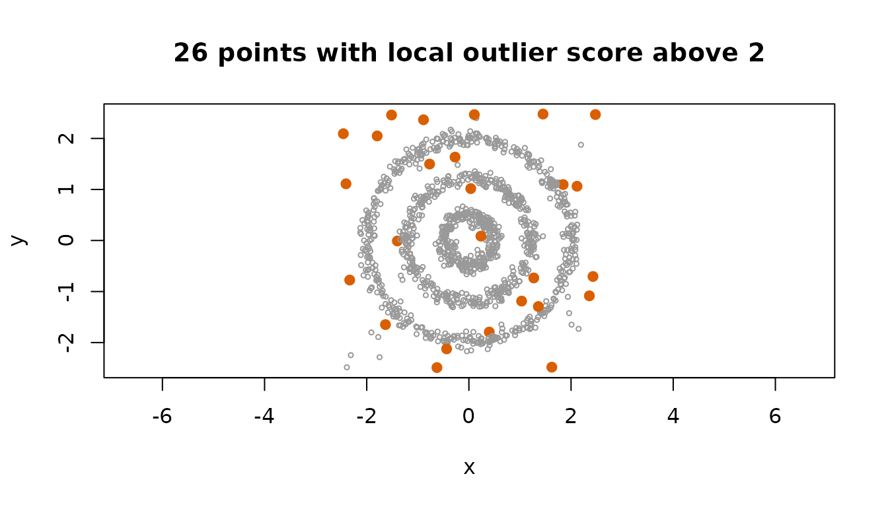

# Distances and neighbours

Every clustering algorithm rests on a notion of how far apart two rows
are. shoal exposes that layer directly through two functions.
[`shoal_dist()`](https://belian-earth.github.io/shoal/reference/shoal_dist.md)
computes every pairwise distance and returns R’s own `dist` class.
[`shoal_knn()`](https://belian-earth.github.io/shoal/reference/shoal_knn.md)
finds each row’s `k` nearest neighbours and returns their indices and
distances. Both take the same nine metrics and agree with each other to
the last bit.

The calls are simple. The decisions around them are not, and this
vignette is organised around four of them: which metric, a full matrix
or neighbours only, a tree or a scan, and what to build from a neighbour
result once you have one.

``` r

library(shoal)
x <- as.matrix(iris[, 1:4])
```

## Which metric

| Metric | Measures | Reach for it when |
|----|----|----|
| `euclidean` | Straight-line distance. | Columns are on comparable scales. The default, and what k-means assumes. |
| `manhattan` | Sum of absolute differences. | Outlying values in one column should not dominate. |
| `maximum` | Largest single difference. | One column out of tolerance is what matters. |
| `minkowski` | The family that contains the three above, with power `p`. | You want something between Manhattan and Euclidean. |
| `canberra` | Absolute differences relative to magnitude. | Counts and abundances, where a difference of 1 means more near zero. |
| `binary` | Fraction of positions where exactly one row is non-zero. | Presence and absence data. |
| `cosine` | One minus the cosine of the angle between the rows. | Direction matters and magnitude does not: embeddings, term counts. |
| `correlation` | One minus the Pearson correlation across the columns. | Profiles should match in shape regardless of level or scale. |
| `mahalanobis` | Euclidean distance after decorrelating and scaling the columns. | Columns are correlated or on different scales and you want each to count once. |

The metrics shared with
[`stats::dist()`](https://rdrr.io/r/stats/dist.html) follow its
definitions exactly, including the way Canberra drops degenerate terms
and the fact that its denominator is `|x| + |y|` as the C code computes
it, not the `|x + y|` its documentation states. Cosine is correlation
without centring each row on its own mean, so the two agree on rows that
already average zero.

A simple check of what a metric does is to ask how often a row’s nearest
neighbours share its label. On iris, most metrics agree with the species
about 95 percent of the time.

``` r

species <- iris$Species
agreement <- function(metric) {
  nn <- shoal_knn(x, k = 5L, metric = metric)
  mean(species[nn$id] == species[row(nn$id)])
}
sapply(c("euclidean", "manhattan", "cosine", "correlation", "mahalanobis"),
       agreement)
#>   euclidean   manhattan      cosine correlation mahalanobis 
#>   0.9480000   0.9466667   0.9573333   0.9480000   0.8613333
```

Mahalanobis does worse, and the reason is instructive. It whitens with
the covariance of the whole sample, and in iris the largest correlated
direction, petal length against petal width, is also the direction that
separates the species. Whitening on the pooled covariance shrinks
exactly the axis that carries the signal. Mahalanobis is the right
choice when the correlation is within-group structure you want to
discount, not between-group structure you want to find. Pass `cov` to
whiten with a covariance estimated from a single group, or from a
reference sample, and that problem goes away.

## A full matrix or neighbours only

A distance matrix holds every pair, which is `n (n - 1) / 2` numbers. A
neighbour search holds `k` per row. The difference is not a constant
factor; it is the difference between quadratic and linear.

``` r

d <- shoal_dist(x)
nn <- shoal_knn(x, k = 10L)
object.size(d)
#> 90800 bytes
object.size(nn$dist) + object.size(nn$id)
#> 20256 bytes
```

At 150 rows both are trivial. At 50,000 rows the matrix is 9.3 GB and
the neighbours are under 6 MB. At a million rows the matrix does not
exist, and the neighbours are a search of a few seconds.

Reach for the matrix when a consumer needs every pair:
[`shoal_hclust()`](https://belian-earth.github.io/shoal/reference/shoal_hclust.md),
[`shoal_silhouette()`](https://belian-earth.github.io/shoal/reference/shoal_silhouette.md),
[`cmdscale()`](https://rdrr.io/r/stats/cmdscale.html),
[`cluster::pam()`](https://rdrr.io/pkg/cluster/man/pam.html). Even then,
if the matrix is only a stepping stone to a dendrogram, pass the raw
data to
[`shoal_hclust()`](https://belian-earth.github.io/shoal/reference/shoal_hclust.md)
instead; it writes the distances straight into the buffer the clustering
consumes and never holds a second copy. Reach for neighbours for
everything else.

The two functions share every convention that can be shared. Rows with
missing or non-finite values are dropped by
[`shoal_dist()`](https://belian-earth.github.io/shoal/reference/shoal_dist.md),
with a warning, and refused by
[`shoal_knn()`](https://belian-earth.github.io/shoal/reference/shoal_knn.md),
because dropping rows would renumber the indices it returns. Ties in a
neighbour search are broken by row index, so a result is fully
determined by its input.

## A tree or a scan

[`shoal_knn()`](https://belian-earth.github.io/shoal/reference/shoal_knn.md)
has two exact search algorithms behind it. A kd-tree partitions space
and skips regions that cannot hold a nearer point. A scan compares every
pair in parallel. Both return identical results, tie order included, so
the choice is purely about speed, and the rule is dimension. A tree
prunes well in a few dimensions and hardly at all beyond about ten,
where the scan is several times faster than any tree. The default
`search = "auto"` takes the tree up to 8 columns and the scan beyond.

``` r

tree <- shoal_knn(x, k = 5L, search = "kdtree")
scan <- shoal_knn(x, k = 5L, search = "brute")
identical(tree$id, scan$id) && identical(tree$dist, scan$dist)
#> [1] TRUE
```

The tree serves every metric except Canberra and binary, whose distances
no rectangle can bound. Cosine and correlation go through a normalised
copy of the rows, on which Euclidean distance orders points exactly as
the metric does, while the distances reported are still the metric
itself. Force `search = "brute"` when you know the data is wide, or
`search = "kdtree"` when it is narrow but has more than 8 columns and
you want to check for yourself.

## What to build from neighbours

A neighbour result is a small, regular structure: `id` and `dist`, one
row per point, nearest first. Several things the package does not do
itself are a few lines from it.

### The radius for DBSCAN

Each point’s distance to its `k`-th neighbour, sorted, has an elbow
where the dense points end and the sparse ones begin. That elbow is
`eps`, with `min_samples = k + 1` because DBSCAN counts the point
itself. The [`plot()`](https://rdrr.io/r/graphics/plot.default.html)
method draws it;
[`vignette("shoal")`](https://belian-earth.github.io/shoal/articles/shoal.md)
walks through the choice on the `rings` data.

``` r

plot(shoal_knn(rings, k = 4L))
abline(h = 0.2, lty = 2)
```


### A neighbour graph

Many methods, spectral clustering and UMAP among them, start from a
sparse graph that joins each point to its neighbours. The edge list is a
reshape of the result, and keeping only edges that appear in both
directions gives the mutual neighbour graph, which is sparser and drops
the links from noise points into clusters.

``` r

nn <- shoal_knn(rings, k = 5L)
edges <- data.frame(
  from = rep(seq_len(nrow(nn$id)), times = ncol(nn$id)),
  to = as.vector(nn$id),
  weight = as.vector(nn$dist)
)
pair <- paste(pmin(edges$from, edges$to), pmax(edges$from, edges$to))
mutual <- edges[duplicated(pair), ]
c(directed = nrow(edges), mutual = nrow(mutual))
#> directed   mutual 
#>     6300     2337
```

`igraph::graph_from_data_frame(mutual, directed = FALSE)` takes that as
it is.

### A local outlier score

A point whose `k`-th neighbour is far away, relative to how far its
neighbours’ own `k`-th neighbours are, sits in a sparser region than the
points around it. The ratio is a local outlier score in the spirit of
the local outlier factor, computed in two lines.

``` r

dk <- nn$dist[, ncol(nn$dist)]
score <- dk / rowMeans(matrix(dk[nn$id], ncol = ncol(nn$id)))
top <- order(score, decreasing = TRUE)[1:60]

hdb <- shoal_hdbscan(rings, min_cluster_size = 15L, min_samples = 5L)
table(hdbscan_noise = is.na(hdb$cluster[top]))
#> hdbscan_noise
#> FALSE  TRUE 
#>    39    21
```

The 60 highest scores catch 21 of the 26 points HDBSCAN calls noise. The
rest are points on a ring that happen to sit in a local gap, which is
what a purely local score will say: it knows about the neighbourhood and
nothing about the cluster. HDBSCAN’s GLOSH score, returned on every
result, is the principled version of the same idea and uses the cluster
hierarchy to tell the two apart.

A score of 2 says a point’s neighbourhood is twice as sparse as its
neighbours’ are. Marking the points above that shows where the score
puts its attention.

``` r

flag <- score > 2
plot(rings, asp = 1, pch = ifelse(flag, 19, 1), cex = ifelse(flag, 1, 0.5),
     col = ifelse(flag, "#D95F02", "grey60"),
     main = sprintf("%d points with local outlier score above 2", sum(flag)))
```



### Classifying new rows

Given labelled rows, the label of a new row is a vote among its nearest
labelled neighbours. `query` searches new rows against the reference set
without them being candidates for one another.

``` r

set.seed(1)
train <- sample(nrow(x), 100)
test <- setdiff(seq_len(nrow(x)), train)

q <- shoal_knn(x[train, ], k = 5L, query = x[test, ])
votes <- matrix(as.character(species[train])[q$id], ncol = ncol(q$id))
predicted <- apply(votes, 1, function(v) names(which.max(table(v))))
table(predicted, truth = species[test])
#>             truth
#> predicted    setosa versicolor virginica
#>   setosa         16          0         0
#>   versicolor      0         19         1
#>   virginica       0          0        14
```

For Mahalanobis, the query rows are whitened with the reference set’s
covariance, so the geometry is the reference set’s and not the query’s.

## Practical notes

- Both functions accept a data frame and use its numeric columns.
- [`shoal_knn()`](https://belian-earth.github.io/shoal/reference/shoal_knn.md)
  needs `k` below the number of rows without a query, since a row is not
  its own neighbour, and at most the number of rows with one.
- The tree path holds one extra copy of the data, reordered so that each
  leaf is contiguous in memory. On a machine where that copy matters,
  use `search = "brute"`.
- Both run on the package thread pool; see
  [`shoal_threads()`](https://belian-earth.github.io/shoal/reference/shoal_threads.md).
