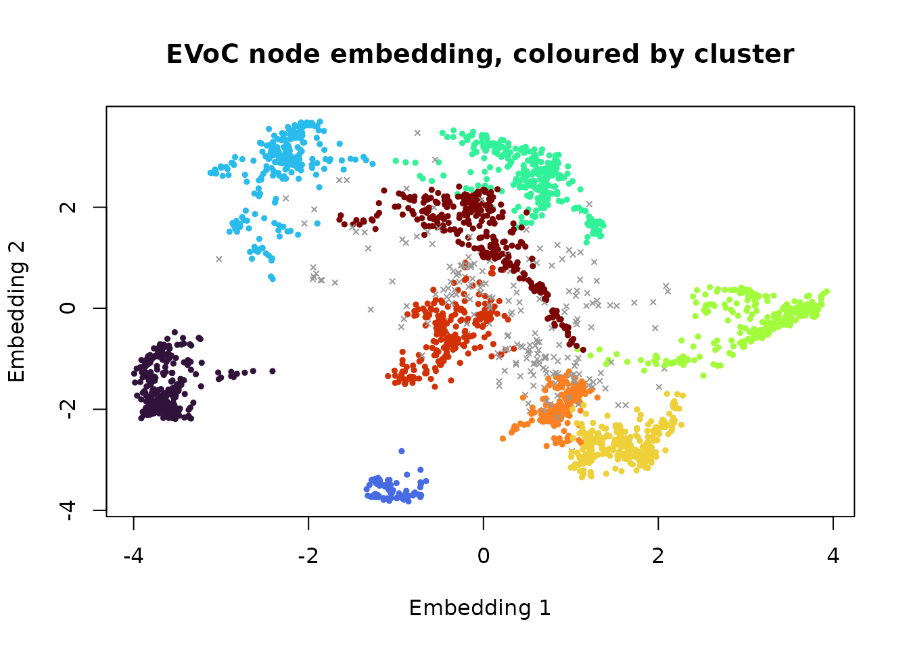

# Clustering embeddings with EVoC

Embedding models turn text, images and other objects into vectors whose
directions carry meaning: two posts about the same thing point the same
way. Clustering such vectors is how topics are discovered in a corpus,
and it is what
[`shoal_evoc()`](https://belian-earth.github.io/shoal/reference/shoal_evoc.md)
is for. This vignette runs it on real sentence embeddings, looks at what
it returns, and compares it with the other ways of clustering the same
vectors.

``` r

library(shoal)
```

## The data

`newsgroups` holds 2,400 posts from eight groups of the 20 Newsgroups
corpus, embedded with a sentence-transformer and reduced to 64
dimensions (see
[`?newsgroups`](https://belian-earth.github.io/shoal/reference/newsgroups.md)
for how). The group each post came from is kept for scoring, along with
the opening of each post for reading.

``` r

str(newsgroups)
#> List of 3
#>  $ embedding: num [1:2400, 1:64] 0.402 0.348 0.402 0.29 0.267 ...
#>  $ group    : Factor w/ 8 levels "comp.graphics",..: 4 4 4 4 4 4 4 4 4 4 ...
#>  $ snippet  : chr [1:2400] "Here is a review of some of the off-ice things that have affected the AHL this year. ST JOHN'S MAPLE LEAFS PROBLEMS The " "Everyone... Read this. If you have already sent your predictions, please correct the Patrick division if you would like." "Here are the standings after game 1 of each of the divisional semi-finals. (Hey, look who's #4!) I'll try to post the st" "I don't think Primeau is necessarily a bad pick...I'm was just trying to locate the beginning of Murray's decisions...he" ...
table(newsgroups$group)
#> 
#>          comp.graphics           misc.forsale              rec.autos 
#>                    300                    300                    300 
#>       rec.sport.hockey                sci.med              sci.space 
#>                    300                    300                    300 
#> soc.religion.christian  talk.politics.mideast 
#>                    300                    300
```

Scores below are the adjusted Rand index (ARI) against the group labels:
1 for a perfect match, 0 for chance. Noise counts as its own class.

``` r

ari <- function(a, b) {
  a <- ifelse(is.na(a), -1L, as.integer(factor(a)))
  b <- ifelse(is.na(b), -1L, as.integer(factor(b)))
  tab <- table(a, b)
  comb2 <- function(x) x * (x - 1) / 2
  sum_ij <- sum(comb2(tab))
  sum_a <- sum(comb2(rowSums(tab)))
  sum_b <- sum(comb2(colSums(tab)))
  expected <- sum_a * sum_b / comb2(sum(tab))
  (sum_ij - expected) / ((sum_a + sum_b) / 2 - expected)
}
```

## One call

EVoC needs no number of clusters and no distance threshold. It builds a
nearest-neighbour graph under cosine distance, learns a compact node
embedding of that graph, and density-clusters the embedding at every
granularity it can find. `min_cluster_size` is the one parameter worth
setting up front: the upstream default of 5 suits corpora of hundreds of
thousands of documents, and over-fragments a few thousand.

``` r

x <- newsgroups$embedding
timing <- system.time(ev <- shoal_evoc(x, min_cluster_size = 30L))
ev
#> 
#> ── EVoC Clustering
#> Metric: "cosine"
#> Parameters: n_neighbors = 15, noise_level = 0.5, min_cluster_size = 30,
#> min_samples = 5, n_epochs = 50, seed = 1
#> Clusters: 9, Noise points: 230
#> Layers (finest first, ✔ = selected):
#>   1: 22 clusters, 814 noise, persistence 0
#>   2: 17 clusters, 674 noise, persistence 494.2
#> ✔ 3: 9 clusters, 230 noise, persistence 799.6
timing[["elapsed"]]
#> [1] 0.088
```

``` r

table(cluster = ev$cluster, group = newsgroups$group, useNA = "ifany")
#>        group
#> cluster comp.graphics misc.forsale rec.autos rec.sport.hockey sci.med sci.space
#>    1                0            2         0              289       2         0
#>    2                0            0         0                0       0         0
#>    3               10          235         3                1       0         1
#>    4              261            6         0                0       1         4
#>    5                1            0         0                1     265        12
#>    6                0            0         0                0       1         0
#>    7                0            0         1                0       0         0
#>    8                0            0         1                0       2       221
#>    9                1           24       267                0       1         3
#>    <NA>            27           33        28                9      28        59
#>        group
#> cluster soc.religion.christian talk.politics.mideast
#>    1                         0                     1
#>    2                         1                    87
#>    3                         0                     1
#>    4                         0                     0
#>    5                         7                     0
#>    6                       266                     1
#>    7                         6                   182
#>    8                         0                     1
#>    9                         1                     0
#>    <NA>                     19                    27
ari(newsgroups$group, ev$cluster)
#> [1] 0.7474819
```

Seven of the eight groups come back as a cluster each, with a tenth of
the corpus set aside as noise. The eighth, `talk.politics.mideast`,
comes back as two clusters. The labels say that is an error; the posts
say otherwise. The opening lines of a few from each show that the group
holds two separate arguments, one about Turkey, Armenia and Greece and
one about Israel and the Holocaust, and EVoC has found a distinction the
labels do not have.

``` r

mideast <- table(ev$cluster[newsgroups$group == "talk.politics.mideast"])
halves <- as.integer(names(sort(mideast, decreasing = TRUE)[1:2]))

set.seed(2)
for (h in halves) {
  members <- which(!is.na(ev$cluster) & ev$cluster == h)
  cat("Cluster", h, "\n")
  cat(paste0("  ", substr(newsgroups$snippet[sample(members, 4)], 1, 90)), sep = "\n")
}
#> Cluster 7 
#>   It seems that President Clinton can recognize Jerusalem as Israels capitol while still kee
#>   The comparison of the Palestinian situation with the Holocaust is insulting and completely
#>   WASHINGTON - A stark reminder of the Holocaust--a speech by Nazi SS leader Heinrich Himmle
#>   i would like to remind my jewish colleague mzm that much of the stories of the holocaust (
#> Cluster 2 
#>   [...} Living through those days at the age of 20 and following the internal and external n
#>   Because, the x-Soviet Armenian government got away with the genocide of 2.5 million Turkis
#>   From article <1qvgu5INN2np@lynx.unm.edu>, by osinski@chtm.eece.unm.edu (Marek Osinski): Th
#>   Is that what turns you on? The truth needs to be told over and over again. There are Armen
```

## Every layer, not one

A corpus rarely has one right granularity. EVoC therefore returns every
stable layer of the cluster hierarchy, finest first, and only chooses
which one fills `cluster`: by default the most persistent, matching the
reference implementation. The others are on the result.

``` r

layer_summary <- data.frame(
  layer = seq_along(ev$layers),
  clusters = vapply(ev$layers, function(l) length(unique(l[!is.na(l)])), integer(1)),
  noise = vapply(ev$layers, function(l) sum(is.na(l)), integer(1)),
  persistence = round(ev$persistence, 1),
  ari = round(vapply(ev$layers, function(l) ari(newsgroups$group, l), numeric(1)), 3)
)
layer_summary
#>   layer clusters noise persistence   ari
#> 1     1       22   814         0.0 0.227
#> 2     2       17   674       494.2 0.360
#> 3     3        9   230       799.6 0.747
```

Choosing a different layer afterwards is an index, not a refit:

``` r

finest <- ev$layers[[1]]
table(finest, newsgroups$group, useNA = "ifany")[1:6, ]
#>       
#> finest comp.graphics misc.forsale rec.autos rec.sport.hockey sci.med sci.space
#>      1             0            0         0                0       0         0
#>      2             0            0         0               30       0         0
#>      3             0            0         0               37       0         0
#>      4             0            0         0               81       0         0
#>      5             0            0         0               66       0         0
#>      6             7            3         1                3       5         6
#>       
#> finest soc.religion.christian talk.politics.mideast
#>      1                      1                    87
#>      2                      0                     0
#>      3                      0                     1
#>      4                      0                     0
#>      5                      0                     0
#>      6                     12                    16
```

## Seeing the clusters

The node embedding EVoC learned is on the result too. It has four
dimensions here, and the clustering used all of them, so the first two
give a rough picture rather than an exact one: clusters that overlap in
this view are separated in the other two.

``` r

k <- ev$n_clusters
plot(ev$embedding[, 1:2],
     col = ifelse(is.na(ev$cluster), "grey60", shoal_palette(k)[ev$cluster]),
     pch = ifelse(is.na(ev$cluster), 4, 19), cex = 0.5,
     xlab = "Embedding 1", ylab = "Embedding 2",
     main = "EVoC node embedding, coloured by cluster")
```



Each observation also has a membership strength for its cluster in
`strengths`: 1 for a point that joined its cluster at full density,
lower for one that only attached as the density threshold fell. Two
thirds of members score exactly 1, so the strength is a flag for the
doubtful rather than a ranking of the core. The weakest members of the
`rec.autos` cluster are a mixed bag: a post from another group, and
posts only loosely about cars.

``` r

s <- ev$strengths[[ev$layer]]
mean(s[!is.na(ev$cluster)] < 1)
#> [1] 0.340553

autos <- as.integer(names(which.max(table(ev$cluster[newsgroups$group == "rec.autos"]))))
members <- which(!is.na(ev$cluster) & ev$cluster == autos)
weakest <- members[order(s[members])][1:5]
data.frame(strength = round(s[weakest], 2), group = newsgroups$group[weakest],
           snippet = substr(newsgroups$snippet[weakest], 1, 55))
#>   strength        group                                                 snippet
#> 1     0.81    rec.autos Not exactly dumb, but who remebers the tachometer on th
#> 2     0.82 misc.forsale My girlfriend switched to gas-permeable hard lenses and
#> 3     0.82    rec.autos seningen@maserati.ross.com (Mike Seningen) The funny th
#> 4     0.83    rec.autos ...and in San Francisco recently, some of our finest ex
#> 5     0.85    rec.autos I was recently thumbing through the 1993 Lemon-Aid New
```

## Against the alternatives

Three other ways to cluster the same vectors, with what each needs from
you.

``` r

library(uwot)

score <- function(name, cluster, seconds) {
  data.frame(method = name,
             clusters = length(unique(cluster[!is.na(cluster)])),
             noise = sum(is.na(cluster)),
             ari = round(ari(newsgroups$group, cluster), 3),
             seconds = round(seconds, 2))
}

# HDBSCAN straight on the vectors, with the cosine metric.
t_hdb <- system.time(
  hdb <- shoal_hdbscan(x, min_cluster_size = 15L, min_samples = 10L,
                       metric = "cosine", boruvka = FALSE)
)

# UMAP to two dimensions under cosine distance, then HDBSCAN.
set.seed(42)
t_umap <- system.time({
  u <- umap(x, n_neighbors = 30, min_dist = 0, metric = "cosine", n_threads = 2)
  uh <- shoal_hdbscan(u, min_cluster_size = 40L, min_samples = 10L)
})

# k-means, told the right number of groups.
t_km <- system.time(km <- shoal_kmeans(x, k = 8L))

rbind(
  score("EVoC", ev$cluster, timing[["elapsed"]]),
  score("HDBSCAN on the vectors", hdb$cluster, t_hdb[["elapsed"]]),
  score("UMAP then HDBSCAN", uh$cluster, t_umap[["elapsed"]]),
  score("k-means, k = 8", km$cluster, t_km[["elapsed"]])
)
#>                   method clusters noise   ari seconds
#> 1                   EVoC        9   230 0.747    0.09
#> 2 HDBSCAN on the vectors        7  1651 0.097    2.63
#> 3      UMAP then HDBSCAN       13   151 0.679    3.76
#> 4         k-means, k = 8        8     0 0.780    0.11
```

HDBSCAN on the raw vectors is the case EVoC exists to fix: in 64
dimensions there is no density contrast to find, so most of the corpus
is noise, and the spatial index is slow getting there. UMAP followed by
HDBSCAN is the usual remedy and works, at the cost of two stages, two
sets of parameters, a stochastic layout, and tens of times the running
time. EVoC does the same job in one call, and here does it a little
better.

k-means scores well when told there are eight groups. It always will on
a corpus with round, evenly sized topics, and it has no way of saying
when that is not so: it cannot report noise, cannot find eleven topics
when asked for eight, and offers no layers. With a known `k` and a clean
corpus it is hard to beat; discovering the structure of an unknown one
is the case for EVoC.

## Stability

EVoC is stochastic, so `seed` matters, and as with any such method the
question is whether another seed finds the same clusters.

``` r

runs <- lapply(1:3, function(seed) shoal_evoc(x, min_cluster_size = 30L, seed = seed)$cluster)
round(c(seeds_1_2 = ari(runs[[1]], runs[[2]]),
        seeds_1_3 = ari(runs[[1]], runs[[3]]),
        seeds_2_3 = ari(runs[[2]], runs[[3]])), 3)
#> seeds_1_2 seeds_1_3 seeds_2_3 
#>     0.796     0.882     0.747
```

The runs agree on most of the partition. Where they differ is at the
edges: which doubtful posts are noise, and whether a split like the one
in `talk.politics.mideast` is made. On a corpus of a few thousand posts
that is the expected amount of variation; it shrinks as the corpus
grows, which is the regime EVoC is built for. The same seed, data and
parameters always give bitwise-identical results, whatever the thread
count.

## Practical notes

- Input must be embedding vectors: rows whose direction carries the
  meaning. EVoC normalises them and works in cosine geometry throughout.
  Tabular measurements are not that; use the other algorithms, and see
  [`vignette("umap")`](https://belian-earth.github.io/shoal/articles/umap.md)
  for wide tabular data.
- Raise `min_cluster_size` first. It sets the finest granularity, and
  the default of 5 is calibrated for corpora far larger than most.
- Read the layers before trusting the selected one. Persistence is a
  good heuristic, not a law; on nested topic structure the finest layer
  is often the useful one.
- Expect some noise. Posts that are short, off-topic or between topics
  land in no cluster, which is information rather than failure.
