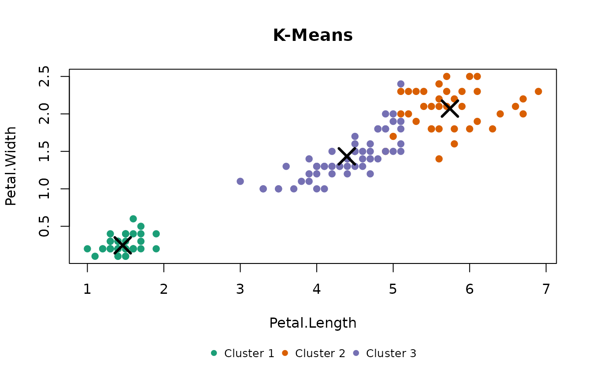
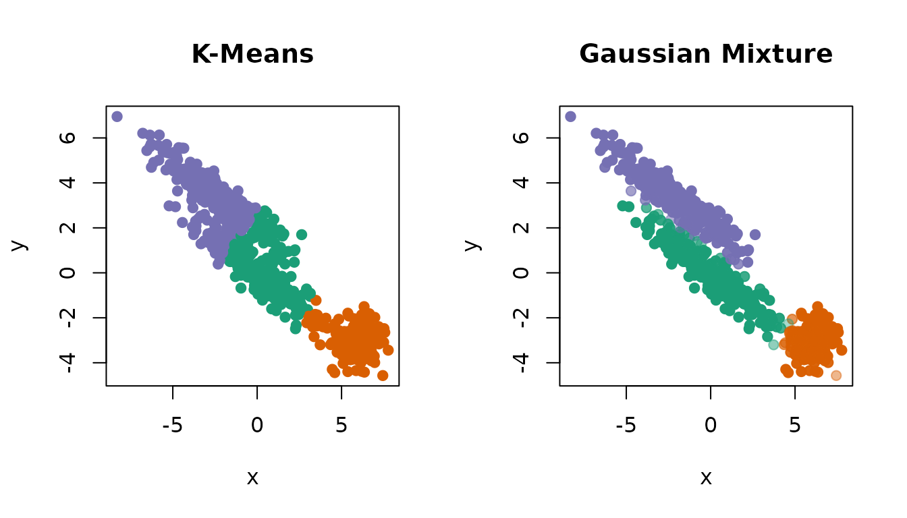
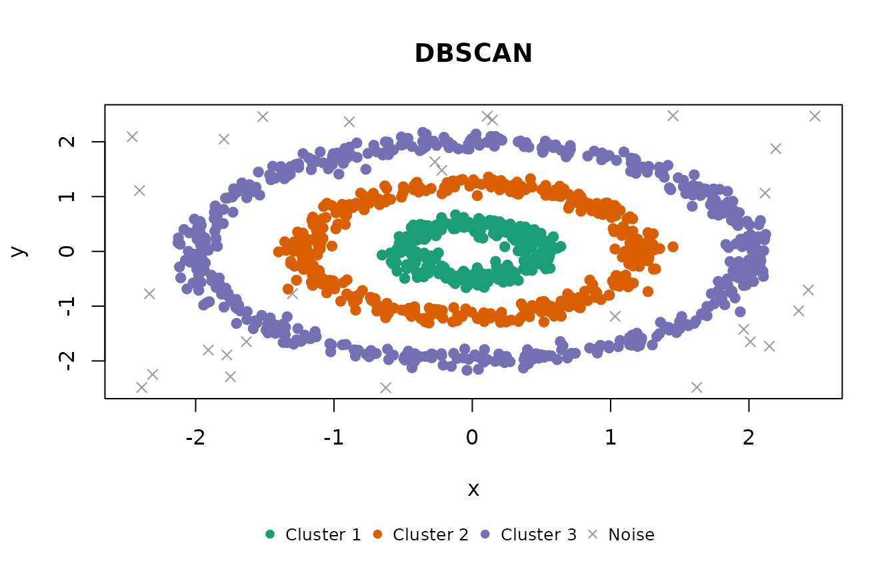
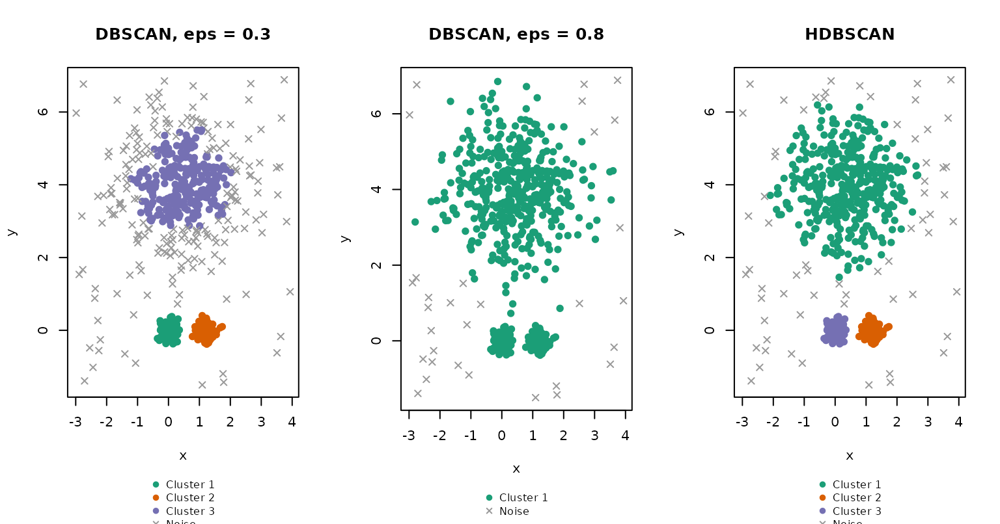
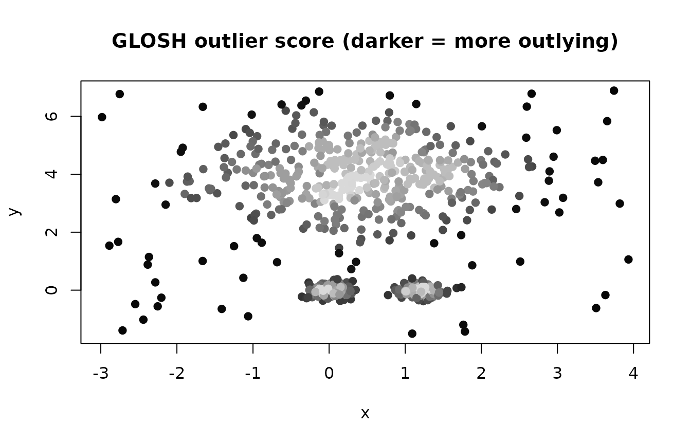
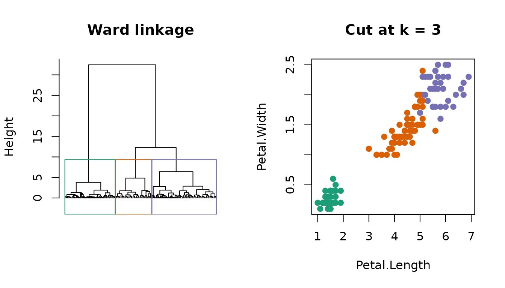
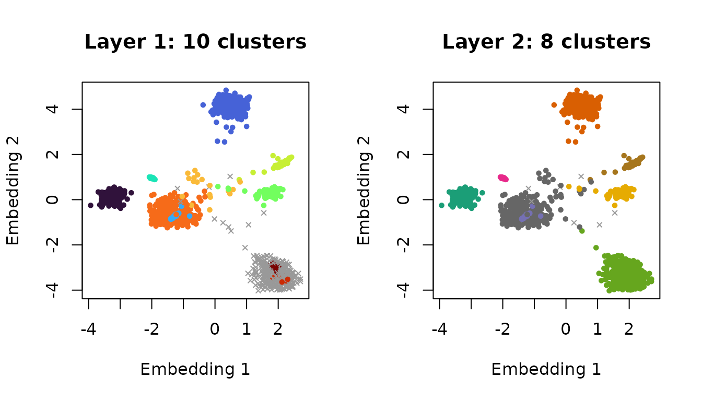

# Get started with shoal

shoal provides six clustering algorithms behind one interface. Each
takes a numeric matrix or data frame, returns an object with the shared
`shoal_clustering` class, and prints and plots the same way. Noise
points, where an algorithm has them, are `NA` in the `cluster` vector.

This vignette introduces each algorithm in turn: what it assumes, the
parameters that matter, and what its clusters look like on data chosen
to show its character. It then turns to the tools around them: the
distance matrix and nearest-neighbour search the algorithms rest on, and
the indices for choosing the number of clusters.

``` r

library(shoal)
```

## What every result has in common

``` r

x <- as.matrix(iris[, 1:4])
fit <- shoal_kmeans(x, k = 3L)

fit$cluster[1:10]
#>  [1] 1 1 1 1 1 1 1 1 1 1
fit$n_clusters
#> [1] 3
fit$n_noise
#> [1] 0
fit$params
#> $k
#> [1] 3
#> 
#> $init
#> [1] "kmeans++"
#> 
#> $n_runs
#> [1] 10
#> 
#> $seed
#> [1] 1
```

`data` holds the matrix the model was fitted to, so
[`plot()`](https://rdrr.io/r/graphics/plot.default.html) needs nothing
else. With two columns it draws a scatter plot; with more, a scatter
plot matrix, or a chosen pair via `xcol` and `ycol`. Colours come from
[`shoal_palette()`](https://belian-earth.github.io/shoal/reference/shoal_palette.md),
and `col` and `pch` can be given directly to colour points by something
other than their cluster, as some of the figures below do.

## k-means: `shoal_kmeans()`

Partitions the data into `k` compact clusters of similar spread by
minimising the within-cluster sum of squares. It is fast and
predictable, and the right baseline when clusters are roughly spherical
and you know how many to expect. It is stochastic in its initialisation;
`seed` controls that, and R’s own random number generator has no effect
on it.

``` r

km <- shoal_kmeans(x, k = 3L, n_runs = 10L, seed = 1L)
km
#> 
#> ── K-Means Clustering
#> Parameters: k = 3, init = kmeans++, n_runs = 10, seed = 1
#> Clusters: 3, Noise points: 0
#> Within-cluster sum of squares: 78.851
#> Cluster sizes: 50, 38, 62
```

The centroids are the model. Overlaying them shows what k-means actually
found: three centres, with every point assigned to the nearest one.

``` r

plot(km, xcol = "Petal.Length", ycol = "Petal.Width")
points(km$centroids[, "Petal.Length"], km$centroids[, "Petal.Width"],
       pch = 4, cex = 2.5, lwd = 3)
```



Because it has cluster centres, it can assign new observations.

``` r

predict(km, x[c(1, 51, 101), ])
#> [1] 1 3 2
```

## Gaussian mixture: `shoal_gmm()`

Fits `k` multivariate Gaussians by expectation-maximisation. Each
component has its own covariance matrix, so clusters can be elongated
and tilted, and correlated or differently scaled features are handled
without pre-scaling. Every observation gets a probability of belonging
to each component; `cluster` is the most likely one and `posterior`
holds the full matrix.

The difference from k-means is easiest to see on clusters that are not
round. Two long, parallel ellipses and a round blob:

``` r

ellipse <- function(n, centre, angle, sx, sy) {
  pts <- cbind(rnorm(n, sd = sx), rnorm(n, sd = sy))
  rot <- matrix(c(cos(angle), sin(angle), -sin(angle), cos(angle)), 2)
  sweep(pts %*% rot, 2, centre, "+")
}

set.seed(3)
angle <- pi / 6
ell <- rbind(
  ellipse(250, c(0, 0), angle, 2.5, 0.4),
  ellipse(250, c(-3.5 * sin(angle), 3.5 * cos(angle)), angle, 2.5, 0.4),
  ellipse(150, c(6, -3), 0, 0.7, 0.7)
)
colnames(ell) <- c("x", "y")

gm <- shoal_gmm(ell, k = 3L)
gm
#> 
#> ── Gaussian Mixture Clustering
#> Parameters: k = 3, init = kmeans, n_runs = 1, seed = 1
#> Clusters: 3, Noise points: 0
#> Log-likelihood: -2362.75, BIC: 4835.61
#> Mixing proportions: 0.377, 0.231, 0.393
```

k-means cuts across the two ellipses, because its boundaries are always
midway between centres. The mixture follows their shape. In the
right-hand panel, points are drawn fainter the less certain their
assignment, using the posterior and the `col` argument.

``` r

par(mfrow = c(1, 2))
km_ell <- shoal_kmeans(ell, k = 3L)
plot(km_ell, col = shoal_palette(3)[km_ell$cluster], pch = 19)

confidence <- apply(gm$posterior, 1, max)
base <- col2rgb(shoal_palette(3)[gm$cluster]) / 255
alpha <- pmin(1, 0.15 + 0.85 * (confidence - 1 / 3) / (2 / 3))
plot(gm, col = rgb(base[1, ], base[2, ], base[3, ], alpha), pch = 19)
```



A fitted mixture has a [`logLik()`](https://rdrr.io/r/stats/logLik.html)
method, so [`AIC()`](https://rdrr.io/r/stats/AIC.html) and
[`BIC()`](https://rdrr.io/r/stats/AIC.html) work on it directly; see
[Choosing the number of clusters](#choosing-k). Only full covariance
matrices are supported.

## DBSCAN: `shoal_dbscan()`

Grows clusters from points that have at least `min_samples` neighbours
within radius `eps`, and labels everything else noise. Clusters can be
any shape, which no centroid-based method can offer. The bundled `rings`
data, three concentric rings plus scattered noise, is the standard case.

``` r

db <- shoal_dbscan(rings, eps = 0.2, min_samples = 5L)
db
#> 
#> ── DBSCAN Clustering
#> Metric: "euclidean"
#> Parameters: eps = 0.2, min_samples = 5
#> Clusters: 3, Noise points: 29
plot(db)
```



`eps` is on the scale of the data, so a value never carries between
datasets. `metric = "cosine"` is available for directional data.

## HDBSCAN: `shoal_hdbscan()`

DBSCAN’s limitation is that `eps` is one global threshold, so every
cluster has to have the same density. HDBSCAN removes it by building the
hierarchy of clusterings across every density at once and keeping the
most stable ones. There is no `eps`; `min_cluster_size` sets the
smallest group worth calling a cluster and `min_samples` how
conservative the density estimate is.

Two tight blobs beside one large diffuse cloud, with uniform noise
around them, shows the difference. No single `eps` serves both
densities: small enough for the blobs, it keeps only the core of the
cloud and calls the rest noise; large enough for the cloud, everything
merges into one cluster.

``` r

set.seed(4)
vd <- rbind(
  cbind(rnorm(150, 0.0, 0.15), rnorm(150, 0, 0.15)),
  cbind(rnorm(150, 1.2, 0.15), rnorm(150, 0, 0.15)),
  cbind(rnorm(400, 0.5, 1.0), rnorm(400, 4, 1.0)),
  cbind(runif(60, -3, 4), runif(60, -2, 7))
)
colnames(vd) <- c("x", "y")

hdb <- shoal_hdbscan(vd, min_cluster_size = 30L, min_samples = 10L)
hdb
#> 
#> ── HDBSCAN Clustering
#> Metric: "euclidean"
#> Parameters: alpha = 1, min_samples = 10, min_cluster_size = 30, boruvka = TRUE
#> Clusters: 3, Noise points: 64
#> GLOSH outlier scores: median 0.281, max 0.977
```

``` r

par(mfrow = c(1, 3), mar = c(4, 4, 3, 1))
plot(shoal_dbscan(vd, eps = 0.3, min_samples = 10L), main = "DBSCAN, eps = 0.3")
plot(shoal_dbscan(vd, eps = 0.8, min_samples = 10L), main = "DBSCAN, eps = 0.8")
plot(hdb, main = "HDBSCAN")
```



HDBSCAN also returns a GLOSH outlier score for every observation, near 0
in the core of a cluster and near 1 far from any. Drawn as a shade
rather than a cluster colour, it grades the whole dataset by how much it
belongs.

``` r

plot(hdb, col = grey(0.85 * (1 - hdb$outlier_scores)), pch = 19,
     main = "GLOSH outlier score (darker = more outlying)")
```



Both density algorithms rely on a spatial index that degrades as the
number of columns grows. For wide data, either reduce the dimension
first (see the UMAP vignette) or, for embedding vectors, use EVoC.

## Hierarchical clustering: `shoal_hclust()`

Merges observations bottom-up into a dendrogram, which can then be cut
at any number of clusters without refitting. It takes a `dist` object,
which
[`shoal_dist()`](https://belian-earth.github.io/shoal/reference/shoal_dist.md)
computes in Rust, or raw data. The result is a standard `hclust`, so
[`cutree()`](https://rdrr.io/r/stats/cutree.html),
[`plot()`](https://rdrr.io/r/graphics/plot.default.html),
[`rect.hclust()`](https://rdrr.io/r/stats/rect.hclust.html) and
[`as.dendrogram()`](https://rdrr.io/r/stats/dendrogram.html) all apply.

``` r

d <- shoal_dist(x)
hc <- shoal_hclust(d, method = "ward")
hc
#> 
#> Call:
#> shoal_hclust(d = d, method = "ward")
#> 
#> Cluster method   : ward 
#> Distance         : euclidean 
#> Number of objects: 150

groups <- cutree(hc, k = 3)
table(groups, iris$Species)
#>       
#> groups setosa versicolor virginica
#>      1     50          0         0
#>      2      0         49        15
#>      3      0          1        35
```

``` r

par(mfrow = c(1, 2))
plot(hc, labels = FALSE, hang = -1, main = "Ward linkage", xlab = "", sub = "")
rect.hclust(hc, k = 3, border = shoal_palette(3))
plot(x[, "Petal.Length"], x[, "Petal.Width"], col = shoal_palette(3)[groups],
     pch = 19, xlab = "Petal.Length", ylab = "Petal.Width", main = "Cut at k = 3")
```



Seven linkage methods are available. Note that `"ward"` is R’s
`"ward.D2"`, and that `"centroid"` and `"median"` take plain distances
where [`stats::hclust()`](https://rdrr.io/r/stats/hclust.html) expects
squared ones; see
[`?shoal_hclust`](https://belian-earth.github.io/shoal/reference/shoal_hclust.md).

## EVoC: `shoal_evoc()`

For embedding vectors: rows that are directions in a high-dimensional
space, such as the output of a text or image model. EVoC builds a
nearest-neighbour graph under cosine distance, learns a compact node
embedding from it, and density-clusters that embedding at several
granularities at once. All layers are returned; `layer` picks which one
populates `cluster`, by default the most persistent.

Eight topics of unequal size as directions in 48 dimensions, plus 100
scattered points:

``` r

set.seed(1)
sizes <- c(400, 300, 250, 200, 150, 100, 60, 40)
centres <- matrix(runif(length(sizes) * 48, -1, 1) * 0.6, nrow = length(sizes))
emb <- rbind(
  centres[rep(seq_along(sizes), times = sizes), ] +
    matrix(rnorm(sum(sizes) * 48, sd = 0.1), ncol = 48),
  matrix(runif(100 * 48, -1, 1) * 0.6, ncol = 48)
)

ev <- shoal_evoc(emb, min_cluster_size = 15L)
ev
#> 
#> ── EVoC Clustering
#> Metric: "cosine"
#> Parameters: n_neighbors = 15, noise_level = 0.5, min_cluster_size = 15,
#> min_samples = 5, n_epochs = 50, seed = 1
#> Clusters: 8, Noise points: 7
#> Layers (finest first, ✔ = selected):
#>   1: 10 clusters, 371 noise, persistence 0
#> ✔ 2: 8 clusters, 7 noise, persistence 346.8
```

The clusters cannot be drawn in 48 dimensions, but the node embedding
EVoC learned on the way is on the result. Its first two dimensions show
every layer: the finest one, fragmented and full of noise, and the
persistent one that was selected.

``` r

draw_layer <- function(i) {
  layer <- ev$layers[[i]]
  k <- length(unique(layer[!is.na(layer)]))
  plot(ev$embedding[, 1:2],
       col = ifelse(is.na(layer), "grey60", shoal_palette(k)[layer]),
       pch = ifelse(is.na(layer), 4, 19), cex = 0.6,
       xlab = "Embedding 1", ylab = "Embedding 2",
       main = sprintf("Layer %d: %d clusters", i, k))
}
par(mfrow = c(1, 2))
draw_layer(1)
draw_layer(ev$layer)
```



EVoC is the wrong tool for ordinary tabular data: it assumes cosine
geometry and is calibrated for thousands to millions of rows. The
upstream default `min_cluster_size = 5` over-fragments small
collections, so raise it first.

## Distances and neighbours: `shoal_dist()` and `shoal_knn()`

Both take the same nine metrics: the six of
[`stats::dist()`](https://rdrr.io/r/stats/dist.html), cosine,
correlation and Mahalanobis.
[`shoal_dist()`](https://belian-earth.github.io/shoal/reference/shoal_dist.md)
returns a plain `dist`, so it drops into
[`cmdscale()`](https://rdrr.io/r/stats/cmdscale.html),
[`cluster::pam()`](https://rdrr.io/pkg/cluster/man/pam.html) or anything
else that wants one.
[`shoal_knn()`](https://belian-earth.github.io/shoal/reference/shoal_knn.md)
keeps only the `k` nearest neighbours of each row, so where a distance
matrix stops being possible somewhere in the tens of thousands of rows,
a neighbour search does not. It is exact, by a kd-tree in a few
dimensions and a parallel scan beyond that, and the two give identical
results.
[`vignette("distances")`](https://belian-earth.github.io/shoal/articles/distances.md)
goes through the choice of metric and what a neighbour result can be
turned into.

``` r

nn <- shoal_knn(rings, k = 4L)
nn
#> 
#> ── k-Nearest Neighbours
#> Metric: "euclidean", Search: "kdtree"
#> Points: 1260, Neighbours: 4
#> Distance to neighbour 4: min 0.01929, median 0.08133, max 1.39
head(nn$id, 3)
#>        1   2   3   4
#> [1,]   2 165 236 183
#> [2,]   1 236 165 183
#> [3,] 265   9 275  59
```

Its [`plot()`](https://rdrr.io/r/graphics/plot.default.html) is the
standard way to choose `eps` for DBSCAN: each point’s distance to its
`k`-th neighbour, sorted. Points on a ring have a small, steady value;
the noise points sit on the sharp rise at the right. `eps` belongs at
the elbow, which here is the 0.2 used above, with `min_samples = k + 1`
because DBSCAN counts the point itself.

``` r

plot(nn)
abline(h = 0.2, lty = 2)
```


## Choosing the number of clusters

[`shoal_metrics()`](https://belian-earth.github.io/shoal/reference/shoal_metrics.md)
computes the Calinski-Harabasz index (higher is better) and
Davies-Bouldin index (lower is better) for any partition, from the data.
[`shoal_silhouette()`](https://belian-earth.github.io/shoal/reference/shoal_silhouette.md)
scores every observation from a distance matrix, and works for any
cluster shape. A fitted mixture’s
[`BIC()`](https://rdrr.io/r/stats/AIC.html) penalises parameters, so it
has an interior optimum where k-means’ inertia does not.

``` r

ks <- 2:8
indices <- do.call(rbind, lapply(ks, function(k) {
  shoal_metrics(shoal_kmeans(x, k = k))
}))
indices$bic <- vapply(ks, function(k) BIC(shoal_gmm(x, k = k)), numeric(1))
indices$silhouette <- vapply(ks, function(k) {
  attr(shoal_silhouette(d, shoal_kmeans(x, k = k)), "avg_width")
}, numeric(1))
indices
#>     n k calinski_harabasz davies_bouldin      bic silhouette
#> 1 150 2          513.9245      0.4042928 574.0178  0.6810462
#> 2 150 3          561.6278      0.6619715 580.8594  0.5528190
#> 3 150 4          530.4871      0.7757009 629.7790  0.4974552
#> 4 150 5          495.5415      0.8059652 670.0892  0.4887489
#> 5 150 6          473.8506      0.9141580 714.9977  0.3648340
#> 6 150 7          440.3742      0.9777679 755.3227  0.3348415
#> 7 150 8          438.7310      0.9681028 805.4316  0.3477685
```

``` r

par(mfrow = c(1, 4), mar = c(4, 4, 3, 1))
for (m in c("calinski_harabasz", "davies_bouldin", "bic", "silhouette")) {
  plot(ks, indices[[m]], type = "b", pch = 19, xlab = "k", ylab = "", main = m)
}
```


Two clusters or three: the indices disagree, and that is the right
answer, because two of the species overlap. shoal reports the evidence
and leaves the decision to you.

## Which algorithm?

| You have | Start with |
|----|----|
| Compact clusters, a known `k` | [`shoal_kmeans()`](https://belian-earth.github.io/shoal/reference/shoal_kmeans.md) |
| Elliptical clusters, or you want probabilities | [`shoal_gmm()`](https://belian-earth.github.io/shoal/reference/shoal_gmm.md) |
| Arbitrary shapes at one density | [`shoal_dbscan()`](https://belian-earth.github.io/shoal/reference/shoal_dbscan.md) |
| Arbitrary shapes at varying density | [`shoal_hdbscan()`](https://belian-earth.github.io/shoal/reference/shoal_hdbscan.md) |
| A dendrogram, or cuts at several `k` | [`shoal_hclust()`](https://belian-earth.github.io/shoal/reference/shoal_hclust.md) |
| Embedding vectors, thousands of rows or more | [`shoal_evoc()`](https://belian-earth.github.io/shoal/reference/shoal_evoc.md) |
