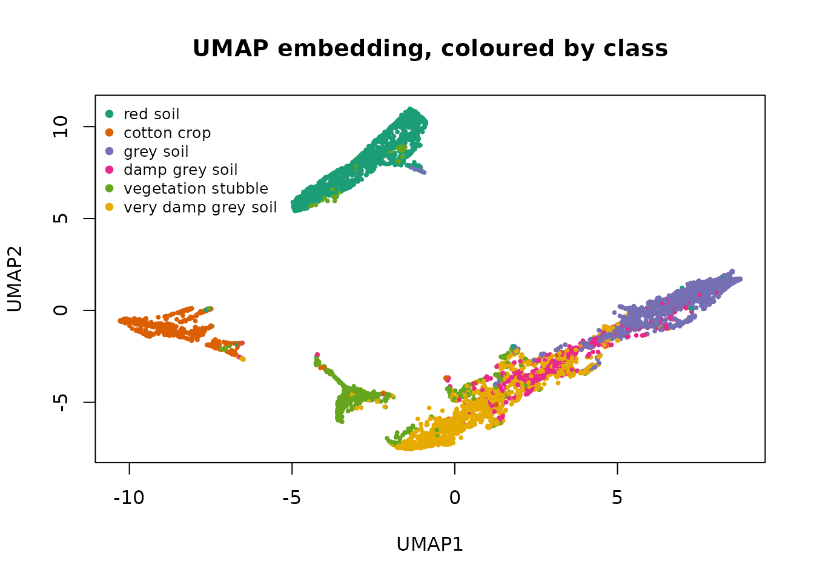
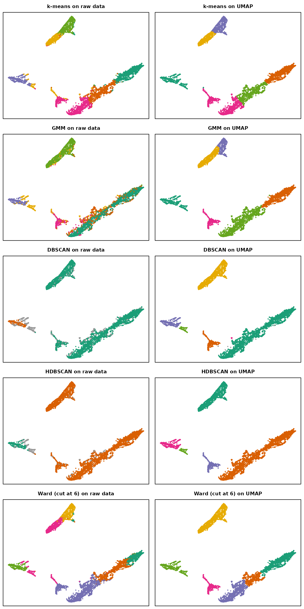
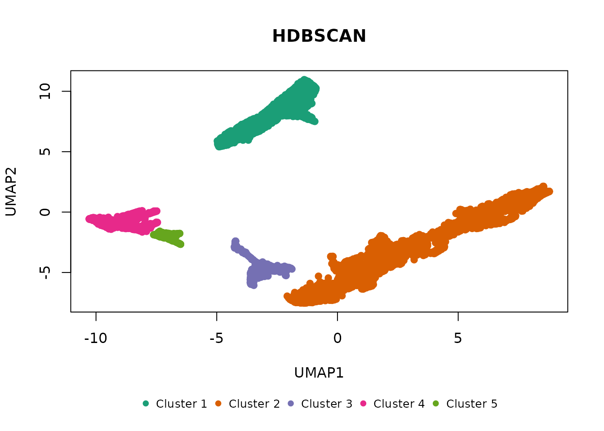

# Clustering after UMAP

Clustering wide data directly is hard for every algorithm here, and
hardest for the density-based ones: distances concentrate as dimension
grows, so the contrast between dense and sparse regions that DBSCAN and
HDBSCAN depend on fades, and the spatial index behind them slows down. A
common remedy is to embed the data into a few dimensions with UMAP
first, then cluster the embedding. This vignette shows what that does to
each algorithm on one real dataset, and where it helps, where it does
not, and what to watch for.

UMAP comes from the [uwot](https://cran.r-project.org/package=uwot)
package; the data from
[mlbench](https://cran.r-project.org/package=mlbench). Neither is
required by shoal.

``` r

library(shoal)
library(uwot)
library(mlbench)
```

## The data

`Satellite` holds 6,435 pixels of Landsat imagery, each described by 36
spectral values, labelled with one of six land-cover classes. Three of
the classes are grades of the same thing: grey soil, damp grey soil and
very damp grey soil.

``` r

data(Satellite)
x <- scale(as.matrix(Satellite[, 1:36]))
truth <- Satellite$classes
table(truth)
#> truth
#>            red soil         cotton crop           grey soil      damp grey soil 
#>                1533                 703                1358                 626 
#>  vegetation stubble very damp grey soil 
#>                 707                1508
```

The labels are used only to score results, with the adjusted Rand index
(ARI): 1 for a perfect match, 0 for chance agreement. Noise points count
as their own class, so an algorithm that discards data pays for it.

``` r

ari <- function(a, b) {
  a <- ifelse(is.na(a), -1L, as.integer(a))
  b <- ifelse(is.na(b), -1L, as.integer(b))
  tab <- table(a, b)
  comb2 <- function(x) x * (x - 1) / 2
  sum_ij <- sum(comb2(tab))
  sum_a <- sum(comb2(rowSums(tab)))
  sum_b <- sum(comb2(colSums(tab)))
  expected <- sum_a * sum_b / comb2(sum(tab))
  (sum_ij - expected) / ((sum_a + sum_b) / 2 - expected)
}

# Every algorithm on one input. Returns the cluster vectors, for drawing,
# and a one-row summary per algorithm.
run_all <- function(data, eps, min_cluster_size) {
  fits <- list(
    "k-means" = shoal_kmeans(data, k = 6L),
    "GMM"     = shoal_gmm(data, k = 6L),
    "DBSCAN"  = shoal_dbscan(data, eps = eps, min_samples = 10L),
    "HDBSCAN" = shoal_hdbscan(data, min_cluster_size = min_cluster_size,
                              min_samples = 10L, boruvka = ncol(data) <= 10L)
  )
  clusters <- lapply(fits, function(f) f$cluster)
  clusters[["Ward (cut at 6)"]] <-
    cutree(shoal_hclust(shoal_dist(data), method = "ward"), 6)

  summary <- do.call(rbind, lapply(names(clusters), function(nm) {
    cl <- clusters[[nm]]
    data.frame(algorithm = nm,
               clusters = length(unique(cl[!is.na(cl)])),
               noise = sum(is.na(cl)),
               ari = round(ari(truth, cl), 3))
  }))
  list(clusters = clusters, summary = summary)
}
```

## Clustering the raw 36 dimensions

``` r

raw <- run_all(x, eps = 2, min_cluster_size = 100L)
raw$summary
#>         algorithm clusters noise   ari
#> 1         k-means        6     0 0.529
#> 2             GMM        6     0 0.468
#> 3          DBSCAN        2   711 0.101
#> 4         HDBSCAN        2   408 0.096
#> 5 Ward (cut at 6)        6     0 0.446
```

The centroid and hierarchical methods find something, because the
classes do differ in their mean spectra. The density methods find almost
nothing: two clusters and hundreds of noise points, an ARI near zero. It
is not a parameter problem. In 36 standardised dimensions the
nearest-neighbour distances of almost every point are similar, so there
is no density contrast to work with, and no `eps` or `min_cluster_size`
recovers it.

## Embedding with UMAP

UMAP builds a nearest-neighbour graph in the original space and lays it
out in a few dimensions so that neighbours stay close. Two settings
matter when the goal is clustering rather than a picture:

- `min_dist = 0` lets points pack tightly, which sharpens the density
  contrast the density algorithms need. The visual default of 0.1
  spreads clusters out for legibility.
- `n_neighbors` trades local detail for global structure. Values around
  30 give clusters that are stable across runs; 15 fragments more.

UMAP is stochastic, so the seed is set, and the result is checked
against other seeds below.

``` r

set.seed(42)
u <- umap(x, n_neighbors = 30, min_dist = 0, n_threads = 2)
colnames(u) <- c("UMAP1", "UMAP2")

pal <- shoal_palette(6)
plot(u, col = pal[as.integer(truth)], pch = 19, cex = 0.4,
     main = "UMAP embedding, coloured by class")
legend("topleft", legend = levels(truth), col = pal, pch = 19, bty = "n", cex = 0.8)
```



Red soil, cotton crop and vegetation stubble each get an island of their
own. The three grey-soil classes form one continuous band, shading from
grey soil at one end to very damp grey soil at the other. That is the
shape of the data, and it decides what each algorithm can do next.

## Clustering the embedding

`eps` for DBSCAN is on the scale of the embedding, not the original
data, so it is chosen afresh.

``` r

embedded <- run_all(u, eps = 0.3, min_cluster_size = 100L)

comparison <- merge(raw$summary, embedded$summary, by = "algorithm",
                    suffixes = c("_raw", "_umap"))
comparison[order(-comparison$ari_umap), c("algorithm", "ari_raw", "ari_umap",
                                          "clusters_umap", "noise_umap")]
#>         algorithm ari_raw ari_umap clusters_umap noise_umap
#> 5 Ward (cut at 6)   0.446    0.712             6          0
#> 2             GMM   0.468    0.612             6          0
#> 4         k-means   0.529    0.549             6          0
#> 1          DBSCAN   0.101    0.462             6         10
#> 3         HDBSCAN   0.096    0.460             5          0
```

The same layout serves as a canvas for both: on the left, each
algorithm’s clusters from the raw 36 dimensions, drawn at the UMAP
coordinates; on the right, its clusters from the embedding itself.

``` r

draw <- function(cluster, title) {
  k <- length(unique(cluster[!is.na(cluster)]))
  noise <- is.na(cluster)
  plot(u, col = ifelse(noise, "grey60", shoal_palette(k)[cluster]),
       pch = ifelse(noise, 4, 19), cex = 0.3, axes = FALSE, xlab = "", ylab = "",
       main = title, cex.main = 0.95)
  box()
}

par(mfrow = c(5, 2), mar = c(0.5, 0.5, 2, 0.5))
for (nm in names(raw$clusters)) {
  draw(raw$clusters[[nm]], paste(nm, "on raw data"))
  draw(embedded$clusters[[nm]], paste(nm, "on UMAP"))
}
```



Three different things happened.

**The density methods went from useless to sound.** DBSCAN and HDBSCAN
now find the islands with almost no noise, and any extra clusters they
report are small fragments at the edges. Their ARI is capped near 0.46
because the grey-soil band comes out as one cluster: it is one dense
region, with no density gap at which to split it into three grades. That
is a limit of the labels’ relationship to the data, not a failure to see
the structure.

``` r

hdb <- shoal_hdbscan(u, min_cluster_size = 100L, min_samples = 10L)
table(cluster = hdb$cluster, truth, useNA = "ifany")
#>        truth
#> cluster red soil cotton crop grey soil damp grey soil vegetation stubble
#>       1     1512           0        20              2                 63
#>       2       15          11      1333            609                170
#>       3        0           8         0              9                462
#>       4        3         570         4              1                  8
#>       5        3         114         1              5                  4
#>        truth
#> cluster very damp grey soil
#>       1                   0
#>       2                1476
#>       3                  18
#>       4                   0
#>       5                  14
plot(hdb)
```



**The model-based methods improved because their assumptions became
true.** In 36 dimensions the Gaussian mixture was fitting ellipsoids to
classes that are not ellipsoidal; on the embedding, each island is
roughly one blob, and the six-component mixture cuts the band into
thirds along its length. Ward linkage gains the most for the same
reason. Both are rewarded by the labels for slicing a gradient into the
pieces the labels happen to use.

**k-means barely changed.** It was already finding the class means in
the original space, and a six-way partition of the embedding is no
better than a six-way partition of the raw data. UMAP helps algorithms
that need local structure; it does little for one that only needs
centroids.

## Stability across UMAP seeds

A UMAP layout is one draw from a stochastic optimisation. Whether the
clusters found on it are real is a question of whether another draw
gives the same clusters. Two more seeds:

``` r

seed_results <- lapply(c(1, 2), function(s) {
  set.seed(s)
  us <- umap(x, n_neighbors = 30, min_dist = 0, n_threads = 2)
  list(
    hdbscan = shoal_hdbscan(us, min_cluster_size = 100L, min_samples = 10L)$cluster,
    ward = cutree(shoal_hclust(shoal_dist(us), method = "ward"), 6)
  )
})

data.frame(
  method = c("HDBSCAN", "Ward (cut at 6)"),
  seed1_vs_seed2 = c(
    round(ari(seed_results[[1]]$hdbscan, seed_results[[2]]$hdbscan), 3),
    round(ari(seed_results[[1]]$ward, seed_results[[2]]$ward), 3)
  ),
  seed1_vs_truth = c(
    round(ari(truth, seed_results[[1]]$hdbscan), 3),
    round(ari(truth, seed_results[[1]]$ward), 3)
  ),
  seed2_vs_truth = c(
    round(ari(truth, seed_results[[2]]$hdbscan), 3),
    round(ari(truth, seed_results[[2]]$ward), 3)
  )
)
#>            method seed1_vs_seed2 seed1_vs_truth seed2_vs_truth
#> 1         HDBSCAN          0.972          0.465          0.447
#> 2 Ward (cut at 6)          0.757          0.710          0.564
```

HDBSCAN returns nearly the same partition whichever layout it is given,
because the islands are the same; only the number of small fragments
varies. Ward’s cut moves with the layout, because where a continuous
band gets divided into three depends on the exact shape it was drawn in.
Its higher score against the labels is partly the luck of the draw. When
a clustering is going to be acted on, the stable one is worth more than
the one that happened to score best.

## Why not EVoC?

[`shoal_evoc()`](https://belian-earth.github.io/shoal/reference/shoal_evoc.md)
runs this recipe in one call: a nearest-neighbour graph, a learned node
embedding of it, and a density clustering of that at several
granularities. It is not the tool for either stage here, though. Its
input must be embedding vectors in the cosine sense, high-dimensional
directions such as a text or image model produces, and 36 spectral bands
are not that. Nor is the UMAP layout: it is a two-dimensional Euclidean
picture, and cosine distance in two dimensions collapses to the angle
from the origin. For data that is embedding vectors, see
[`vignette("evoc")`](https://belian-earth.github.io/shoal/articles/evoc.md),
which compares EVoC with this UMAP-then-cluster recipe on real sentence
embeddings.

## Practical notes

- Standardise the columns before UMAP unless they are already on one
  scale; the neighbour graph is built from Euclidean distances in the
  original space.
- Choose `eps` on the embedding, not the data. Distances in a UMAP
  layout are not the distances you started with, and are not comparable
  between runs.
- Two dimensions are enough for the algorithms here. Embedding to five
  gave the same clusters on this data, at the cost of not being able to
  plot them.
- Report the seed, and check another. A clustering that survives a
  second layout is structure; one that does not is an artefact of the
  drawing.
- Do not use
  [`shoal_metrics()`](https://belian-earth.github.io/shoal/reference/shoal_metrics.md)
  or
  [`shoal_silhouette()`](https://belian-earth.github.io/shoal/reference/shoal_silhouette.md)
  on the embedding to compare against raw-space results: the scores live
  in different spaces. They remain useful for comparing clusterings of
  the same embedding.
