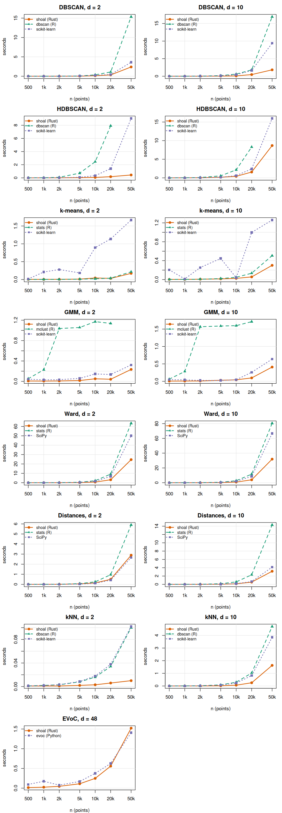

# Benchmarks

Every clustering algorithm in shoal, the distance matrix and the
nearest-neighbour search are benchmarked against the best R alternative
and, where one exists, the Python one, at matched settings: the same k,
restarts, iteration cap, linkage and neighbourhood size. Timings are medians
of three runs on 20 cores and 62 GB, from 500 to 50,000 points, on Gaussian
blobs in 2 and 10 dimensions and, for EVoC, on embedding-like data in 48.



## What the panels show

At 50,000 points unless noted.

- **DBSCAN**: 6 to 9 times faster than the dbscan package and 1.5 to 5 times
  faster than scikit-learn, the gap growing with dimension.
- **HDBSCAN**: 20 times faster than scikit-learn in 2 dimensions and 2 times
  in 10. The dbscan package builds a full distance matrix and is 40 times
  slower at 20,000 points, its largest feasible size here.
- **k-means**: level with base R's Hartigan-Wong in 2 dimensions and 2 times
  faster in 10, with identical within-cluster sums of squares. scikit-learn's
  times are erratic at these sizes because its OpenMP threading oversubscribes
  a 20-core machine.
- **Gaussian mixture**: 20 to 170 times faster than mclust, which fits a
  hierarchical initialisation first, and level with scikit-learn from about
  5,000 points, having been several times faster below that.
- **Ward**: 2.5 to 4.5 times faster than base R and about 2 times faster
  than SciPy. All three run the same nearest-neighbour-chain algorithm, so the
  differences are in computing the distances that feed it. Given raw data,
  `shoal_hclust()` writes the distances straight into the buffer the
  clustering consumes, so at 50,000 points it holds one 10 GB vector where
  `stats::dist()` plus `stats::hclust()` holds two, and that saved copy is
  most of the gap.
- **Distances**: `shoal_dist()` is 2 times faster than `stats::dist()` in 2
  dimensions and 4.5 times in 10, and level with SciPy's `pdist()`, which
  edges it in 2 dimensions where the work is almost all memory traffic. The
  result is written straight into the R vector, one pass, in parallel.
- **kNN**: `shoal_knn()` is 10 times faster than both `dbscan::kNN()` and
  scikit-learn's `NearestNeighbors` in 2 dimensions, where all three use a
  kd-tree, and 2.5 to 3 times faster in 10, where shoal's `search = "auto"`
  has switched to a parallel scan and the others are still in a tree that
  prunes little. Both paths return the same result, ties included, and
  agree with `shoal_dist()` to the bit.
- **EVoC**: level with the reference implementation from about 20,000 points,
  and several times faster below that, where the reference's compiled kernels
  have not amortised. The reference here runs on 20 numba threads.

## Wide data

- The spatial indexes behind DBSCAN, HDBSCAN and `shoal_knn()` degrade as
  dimension grows, as they do everywhere. `shoal_knn()` switches from its
  kd-tree to a parallel scan above 8 columns, where the scan is several times
  faster than a tree. Above a few dozen columns, HDBSCAN's default Boruvka
  tree search is slower than the plain alternative, so pass `boruvka = FALSE`
  there. See `?shoal_hdbscan`.
- For high-dimensional embedding vectors, `shoal_evoc()` is the right tool
  and is orders of magnitude faster than HDBSCAN on the raw vectors.

## Running the benchmarks

Everything runs from the project root through the Makefile in this
directory:

```sh
make -C bench            # data, release install, R and Python runs, collation
make -C bench bench-r    # the R side only
make -C bench compare    # tables and the figure from existing results
```

The steps behind those targets:

```sh
Rscript bench/gen_data.R                  # shared datasets, once
NOT_CRAN=true R CMD INSTALL .             # release build; see the note below
Rscript bench/bench_r.R                   # shoal against the R alternatives
uv run bench/bench_sklearn.py             # the Python alternatives
Rscript bench/compare.R                   # speedup tables and scaling.png
```

`BENCH_ONLY=<algorithm>` on either benchmark script reruns one algorithm and
merges its rows into the existing results, so a change to one function does
not mean rerunning everything. The names are those in the figure: `DBSCAN`,
`HDBSCAN`, `k-means`, `GMM`, `Ward`, `Distances`, `kNN`, `EVoC`.

The results files are not committed; only the figure is. The 50,000-point
Ward and Distances rows hold 10 GB distance vectors, two at a time for Ward,
so budget 30 GB of RAM for a full run. R alternatives run in a subprocess so
that one crashing costs a row rather than the run, and any alternative known
to fail at scale is capped and reported as missing above its cap.

Timings from a `devtools::load_all()` session are meaningless: it compiles
the Rust code without optimisation, and everything runs an order of
magnitude slower or worse. Install the package first, as above.

## Adding a benchmark

Three edits, one per script:

1. An entry in the `benchmarks` list in `bench_r.R`: the shoal call, the
   alternative, its package name and the largest size to run it at.
2. An entry in `BENCHMARKS` in `bench_sklearn.py` with matched settings.
3. The algorithm's name in the `algorithms` vector in `compare.R`, which
   fixes the panel order, and a style entry there if the alternative's
   package is new.

Then `BENCH_ONLY=<name>` on both scripts and `Rscript bench/compare.R`.
